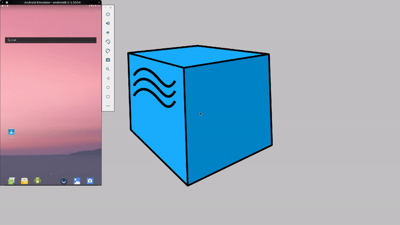
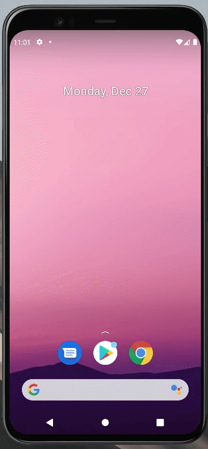
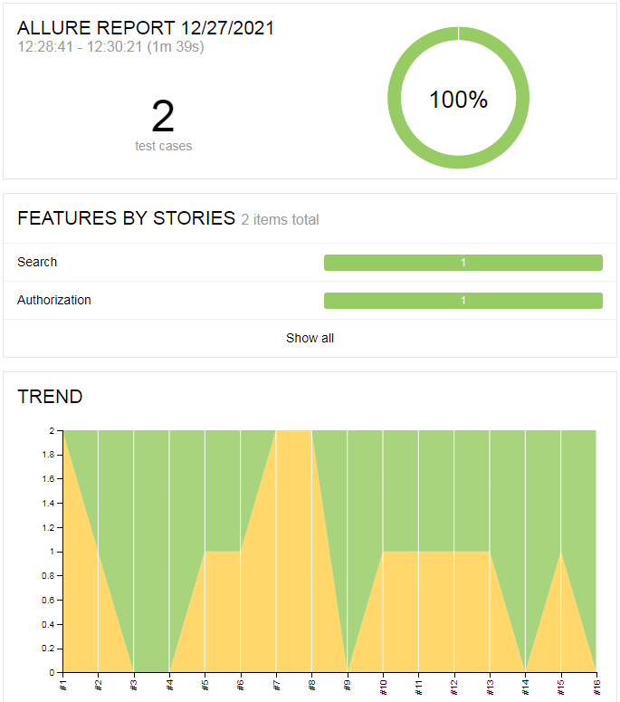
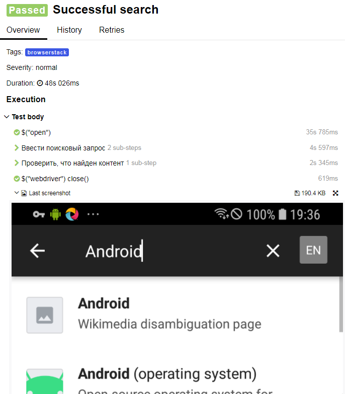
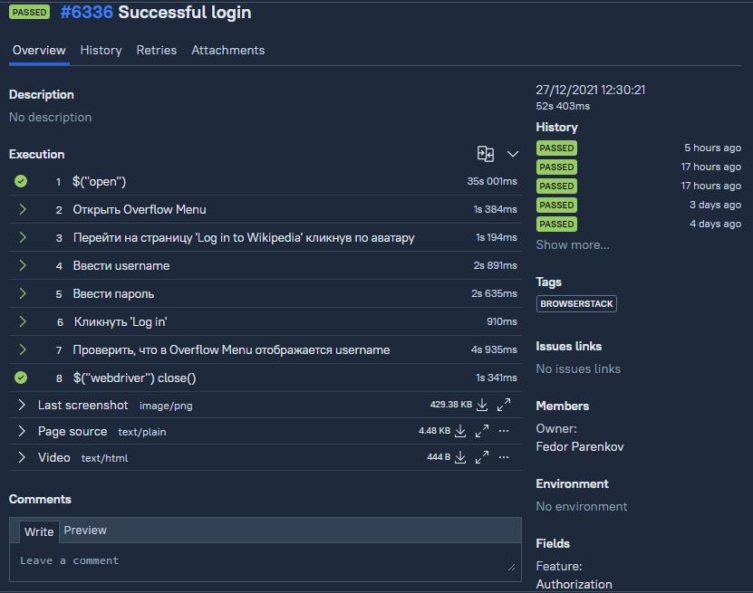
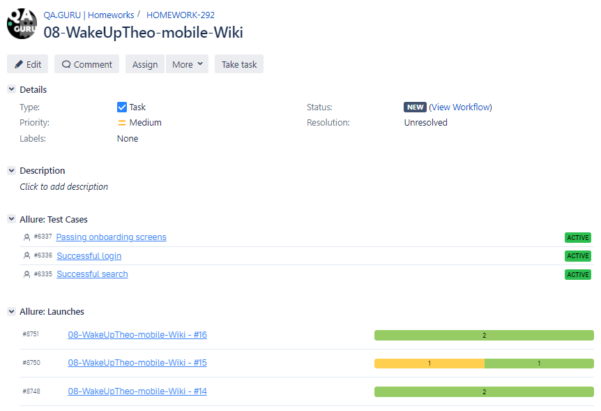
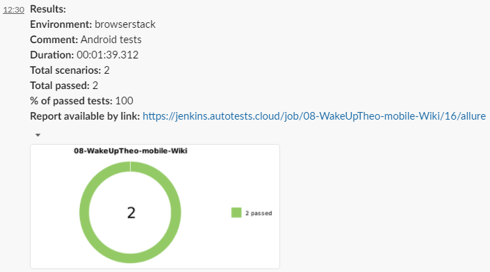
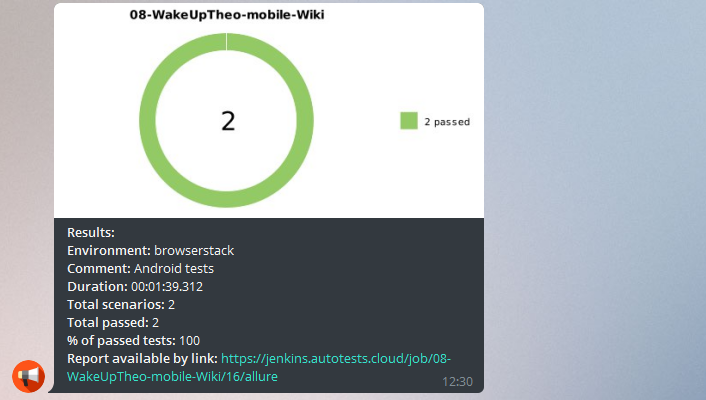

## Автоматизация мобильных UI тестов на Android на примере мобильного приложения Wikipedia
В данном проекте представлен пример UI автотестов для мобильного приложения Wikipedia.<br/>
Тестируемая функциональность:
- Прохождение onboarding страниц;
- Выполнение поиска;
- Авторизация.<br/>

Реализован запуск автотестов на следующем окружении:
- remote real device (Browserstack);
- remote emulator device (Selenoid);
- local emulator device (AVD);
- local real device.<br/>
---
### Использованный технологический стек
 `Java` 
 `Selenide` 
 `JUnit` - написание исходного кода;<br/>
 `Gradle` - сборка проекта;<br/>
 `Jenkins` - конфигурация и запуск сборок;<br/>
 `Selenoid` 
 `Docker` - запуск автотестов удаленно в изолированных сессиях на билд-сервере;<br/>
 `BrowserStack` - запуск автотестов удаленно на реальном устройстве на сайте BrowserStack;<br/>
 `Appium`
 `Android Virtual Device` - запуск автотестов локально на эмуляторе и реальном устройстве;<br/>
 `Allure Report` - формирование отчетности по итогам тестирования;<br/>
 `Allure TestOps` - создание тестовой документации;<br/>
 `Jira` - создание задачи в таск-трекере.<br/>


---
#### Конфигурационные данные для запуска тестов зачитываются из properties-файлов. Запуск тестов производится с использованием приведенных ниже консольных команд.<br/>

### Запуск тестов удаленно
Для удаленного запуска автотестов сконфигурирована :arrow_right: **[job](https://jenkins.autotests.cloud/job/08-WakeUpTheo-mobile-Wiki/)** :arrow_left: в CI Jenkins. В Jenkins job добавлена интеграция с Allure Report и Allure TestOps, а также настроена расслылка оповещений о результатах выполнения тестов в мессенджеры Slack и Telegram.<br/>

**Запуск на устройстве [Browserstack](https://www.browserstack.com/)**

Команда для запуска:
```
gradle clean browserstack -DdeviceHost=browserstack
```
Состав файла **browserstack.properties**:
```
user=<значение user с Browserstack>
key=<значение key с Browserstack>
url=http://hub.browserstack.com/wd/hub
appUrl=bs://c700ce60cf13ae8ed97705a55b8e022f13c5827c // для Samsung Galaxy S9
device=Samsung Galaxy S9 // для Samsung Galaxy S9
osVersion=8.0 // для Samsung Galaxy S9
project=Android Project // значение для примера
build=build-1 // значение для примера
name=android_tests // значение для примера
```

Для прохождения теста на авторизацию на устройстве Browserstack также необходим файл **credentials.properties**, который сформирован в конфигурации Jenkins job.<br/><br/>
Видео теста на авторизацию:<br/><br/>

<br/><br/>


**Запуск на эмуляторе билд-сервера с Selenoid проекта [autotests.cloud](https://selenoid.autotests.cloud/#/)**

Команда для запуска:
```
gradle clean test -DdeviceHost=selenoid
```
Состав файла **selenoid.properties**:
```
url=https://<login>:<password>@selenoid.autotests.cloud/wd/hub/
deviceName=android
osVersion=8.1
locale=en
language=en
appPackage=org.wikipedia.alpha
appActivity=org.wikipedia.main.MainActivity
appPath=https://github.com/wikimedia/apps-android-wikipedia/releases/download/latest/app-alpha-universal-release.apk
```
Видео теста на прохождение onboarding страниц:<br/>




---
### Запуск тестов локально
Для локального запуска тестов используется desktop приложение [Appium Server](https://github.com/appium/appium-desktop). Тесты запускаются на AVD [Android Studio](https://developer.android.com/studio) (эмуляторе) и на реальном устройстве.<br/><br/>
**Запуск на эмуляторе**

Команда для запуска:
```
gradle clean test -DdeviceHost=emulator
```
Состав файла **emulator.properties**:
```
url=http://127.0.0.1:4723/wd/hub
deviceName=Pixel_4_API_30
osVersion=11.0
locale=en
language=en
appPackage=org.wikipedia.alpha
appActivity=org.wikipedia.main.MainActivity
appPath=src/test/resources/app-alpha-universal-release.apk
```
Видео теста на поиск:<br/><br/>



**Запуск на смартфоне**

Команда для запуска:
```
gradle clean test -DdeviceHost=smartphone
```
Состав файла **smartphone.properties**:
```
url=http://127.0.0.1:4723/wd/hub
deviceName=<имя устройства> // в cmd: adb devices
osVersion=<версия Android на устройстве>
locale=en
language=en
appPackage=org.wikipedia.alpha
appActivity=org.wikipedia.main.MainActivity
appPath=src/test/resources/app-alpha-universal-release.apk
```
Видео теста на прохождение onboarding страниц:<br/><br/>


---
### Результаты выполнения тестов


### Отчет в Allure Report





---
### Тестовая документация, сгенерированная в [Allure TestOps](https://allure.autotests.cloud/project/789/dashboards) по итогам прохождения тестов


---
### [Задача](https://jira.autotests.cloud/browse/HOMEWORK-292) в таск-трекере Jira с данными, экспортированными из Allure TestOps


---
### Оповещения о статусе сборки в мессенджерах
<br/>

---
<br/>

